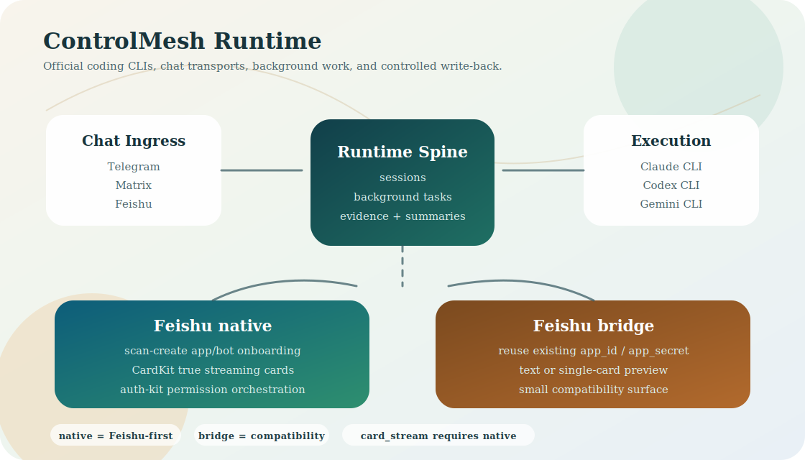

# ControlMesh

中文 | [English](#english)

ControlMesh is a chat-native task runtime for official coding CLIs, with a
Feishu-native product path and first-class Telegram and WeChat entrypoints.

It turns Claude, Codex, Gemini, and other local command-line agents into a
long-running work bot that can run background tasks, ask the parent chat for
missing input, resume the worker, and return results through the same chat.
Feishu native is the runtime-first product path; Telegram and WeChat/Weixin are
also existing important entrypoints. Matrix, sub-agents, cron, webhooks, and API
remain secondary compatibility lanes.



## 中文

### 一句话

ControlMesh 是一个开源的 chat-native task runtime：把 Claude、Codex、
Gemini 等官方编码 CLI 接进飞书、Telegram 和微信，让它们像长期在线的任务
机器人一样执行工作。

它不是一次性的聊天壳。主线是飞书里的后台任务闭环：创建任务、任务后台执行、
任务缺信息时通过 `ask_parent` 回问飞书、父会话恢复任务、结果回到同一聊天上下文。
Telegram 和微信/WeChat 是项目已有的重要入口；Matrix 保留为次级兼容 transport。

### 适合谁

- 想把 Claude、Codex、Gemini 变成飞书、Telegram 或微信里的长期任务机器人。
- 需要任务超过 30 秒时自动转后台，不阻塞聊天的人。
- 需要 worker 缺信息时能在聊天里优雅回问并 resume 的团队。
- 想把机器人部署到 VPS、NAS 或树莓派，做 24/7 工作入口的开发者。

### 产品能力

| 能力 | 说明 |
|---|---|
| Feishu Native Runtime | 内置 `feishu-auth-kit` 插件，提供扫码创建机器人、CardKit 单卡、权限引导、原生 OAPI 工具 |
| 后台任务闭环 | `/tasks/create`、`ask_parent`、`resume`、`list` 构成可演示任务 runtime |
| 官方 CLI worker | 复用 Claude、Codex、Gemini 等官方命令行工具执行任务 |
| 持久工作区 | 会话、任务记忆、文件、输出和运行状态保存在本机 |
| 文件交付 | 文本、图片、音频、文档等输出可发回聊天入口 |
| 多入口触达 | Feishu 是 native/runtime-first 主线；Telegram 和微信/WeChat 是已有重要入口 |
| 运维友好 | `tasks doctor`、Feishu doctor、systemd、restart、配置校验 |
| 兼容入口 | Matrix、API、sub-agent、cron、webhook 仍可用，但不是首页主线 |

### Feishu 体验

ControlMesh 当前公开主线是 Feishu Native 模式。

最小闭环：

- `controlmesh feishu native bootstrap` 进入友好的飞书原生启动入口。
- 内置 [`feishu-auth-kit`](https://github.com/muqiao215/feishu-auth-kit) 作为 Feishu native plugin，完成扫码创建、凭证写回、权限引导、消息上下文、CardKit 和 retry contract。
- `feishu-auth-kit` 的公开仓库是上游元能力仓库；ControlMesh 发布包必须包含这套插件，外部 CLI 只作为开发覆盖或故障 fallback。
- 当 Feishu native 使用 Codex provider 时，agent turn 主路径直接消费内置 plugin 的 `CodexCliRunner`、`AgentEvent` 和 `SingleCardRun`，再由 ControlMesh 负责飞书发送与卡片更新。
- Feishu 卡片展示任务状态、工具步骤和最终结果。
- 长任务通过 task runtime 后台执行，缺信息时走 `/tasks/ask_parent`，父会话再 `/tasks/resume`。
- `/feishu_auth_all` 进行当前 MVP 工具所需权限的批量引导。
- 已接入第一批只读原生工具：联系人搜索、用户读取、群消息读取、Drive 文件列表。

### Telegram 与微信入口

Feishu 是当前 native/runtime-first 主线，但 ControlMesh 不是只服务飞书：

- Telegram：成熟的 token-based 入口，适合个人 DM、群组、长期在线任务机器人和文件交付。
- 微信/WeChat：已有 Weixin iLink 入口，支持扫码登录、长轮询收消息，并在首条微信消息后建立回复上下文。
- Matrix：保留为 secondary/compatibility transport，适合已经使用 Matrix/Element 的团队。

Bridge 模式、Matrix、sub-agent、cron、webhook 和 API 仍是兼容能力；公开产品叙事以
Feishu native + Telegram + 微信入口为主。

### Runtime primitives

任务闭环的稳定 runtime primitives：

- `/tasks/create`
- `/tasks/resume`
- `/tasks/ask_parent`
- `/tasks/list`
- `/interagent/send`

### 快速开始

```bash
pipx install controlmesh
controlmesh
```

从源码运行：

```bash
git clone https://github.com/muqiao215/ControlMesh.git
cd ControlMesh
python -m venv .venv
. .venv/bin/activate
pip install -e ".[matrix,api]"
controlmesh
```

首次启动会引导你完成 CLI 检查、聊天入口配置、时区设置和可选服务安装。

### Feishu 从零配置

Native 模式：

```bash
controlmesh feishu native bootstrap
controlmesh auth feishu setup
controlmesh auth feishu register-begin
controlmesh auth feishu register-poll --device-code "<device_code>" --interval 5 --expires-in 600
controlmesh auth feishu doctor
controlmesh auth feishu probe
```

任务 runtime：

```bash
controlmesh tasks doctor
controlmesh tasks list
```

### 常用命令

```bash
controlmesh status
controlmesh restart
controlmesh service install
controlmesh api enable
```

### 文档

- 安装：[`docs/installation.md`](docs/installation.md)
- Feishu 设置：[`docs/feishu-setup.md`](docs/feishu-setup.md)
- Telegram 设置：[`docs/telegram-setup.md`](docs/telegram-setup.md)
- 微信/WeChat 设置：[`docs/weixin-setup.md`](docs/weixin-setup.md)
- Case-pack contract：[`docs/case-pack/README.md`](docs/case-pack/README.md)
- 文档总览：[`docs/README.md`](docs/README.md)
- 配置示例：[`config.example.json`](config.example.json)

### 许可证

MIT License. See [`LICENSE`](LICENSE).

---

## English

ControlMesh is an open-source chat-native task runtime for command-line coding
agents.

It turns official CLIs such as Claude, Codex, and Gemini into long-running chat
bots that can spawn background tasks, ask the parent chat for missing context,
resume the worker, and return results through the same conversation. Feishu
native is the runtime-first product path; Telegram and WeChat/Weixin are also
existing important entrypoints. Matrix remains a secondary compatibility
transport.

### Who It Is For

- Developers who want Claude, Codex, or Gemini as long-running Feishu,
  Telegram, or WeChat workers.
- Teams that need a task loop: create, ask-parent, resume, return.
- Builders who need agents to work with files and commands, not just produce chat text.
- Operators who want an always-on chat task entrypoint on a VPS, NAS, or Raspberry Pi.

### Features

| Feature | Description |
|---|---|
| Feishu Native Runtime | Bundled `feishu-auth-kit` plugin for scan-created bots, CardKit cards, permission onboarding, and native OAPI tools |
| Background task loop | `/tasks/create`, `ask_parent`, `resume`, and `list` form the runtime loop |
| Official CLI workers | Run Claude, Codex, Gemini, and other local CLI agents |
| Persistent workspace | Keep sessions, task memory, files, outputs, and runtime state on your machine |
| File delivery | Return text, images, audio, documents, and generated artifacts to the chat entrypoint |
| Multi-entrypoint access | Feishu is native/runtime-first; Telegram and WeChat/Weixin are existing important entrypoints |
| Operations | `tasks doctor`, Feishu doctor, systemd service, restart, config validation |
| Compatibility lanes | Matrix, API, sub-agents, cron, and webhooks remain available as secondary lanes |

### Feishu Modes

**Native mode** is the primary product path.

- `controlmesh feishu native bootstrap` is the product-friendly entrypoint.
- Bundles [`feishu-auth-kit`](https://github.com/muqiao215/feishu-auth-kit)
  as the Feishu native plugin for scan-to-create onboarding, credential
  write-back, permission flows, message context, CardKit, and retry contracts.
- The standalone `feishu-auth-kit` repo is the upstream reusable capability
  source. ControlMesh includes a vendored plugin copy; external CLI resolution
  is a development override or fallback, not the product dependency.
- Shows status, tool steps, and final output in a single Feishu card.
- Provides `/feishu_auth_all` for guided authorization of the current MVP tools.
- Includes first read-only native tools for contacts, users, group messages, and Drive files.
- Pairs with the background task runtime so long work can ask the parent chat
  for missing input and then resume cleanly.

### Telegram And WeChat Entrypoints

Feishu is the current native/runtime-first path, but ControlMesh is not a
Feishu-only product:

- Telegram: mature token-based entrypoint for personal DMs, groups, always-on
  task bots, and file delivery.
- WeChat/Weixin: existing Weixin iLink entrypoint with QR login, long-poll
  inbound messages, and reply context after the first WeChat message.
- Matrix: secondary compatibility transport for teams already using
  Matrix/Element.

Bridge mode, Matrix, sub-agents, cron, webhooks, and API remain available. The
public product story now centers on Feishu native plus Telegram and WeChat
entrypoints.

### Runtime primitives

- `/tasks/create`
- `/tasks/resume`
- `/tasks/ask_parent`
- `/tasks/list`
- `/interagent/send`

### Quick Start

```bash
pipx install controlmesh
controlmesh
```

Run from source:

```bash
git clone https://github.com/muqiao215/ControlMesh.git
cd ControlMesh
python -m venv .venv
. .venv/bin/activate
pip install -e ".[matrix,api]"
controlmesh
```

### Feishu Setup

Native mode:

```bash
controlmesh feishu native bootstrap
controlmesh auth feishu setup
controlmesh auth feishu register-begin
controlmesh auth feishu register-poll --device-code "<device_code>" --interval 5 --expires-in 600
controlmesh auth feishu doctor
controlmesh auth feishu probe
```

Task runtime:

```bash
controlmesh tasks doctor
controlmesh tasks list
```

### Documentation

- Installation: [`docs/installation.md`](docs/installation.md)
- Feishu setup: [`docs/feishu-setup.md`](docs/feishu-setup.md)
- Telegram setup: [`docs/telegram-setup.md`](docs/telegram-setup.md)
- WeChat/Weixin setup: [`docs/weixin-setup.md`](docs/weixin-setup.md)
- Case-pack contract: [`docs/case-pack/README.md`](docs/case-pack/README.md)
- Documentation index: [`docs/README.md`](docs/README.md)
- Example config: [`config.example.json`](config.example.json)

### License

MIT License. See [`LICENSE`](LICENSE).
